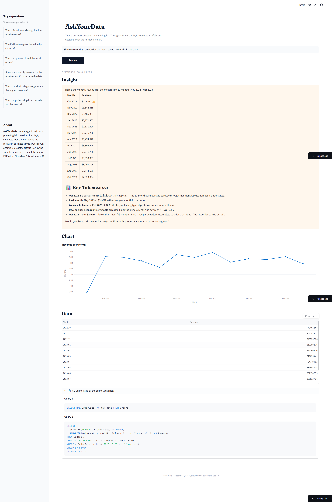

# AskYourData

> An AI agent that turns plain-English business questions into validated SQL queries, executes them safely, and explains the results — with auto-generated charts.

**Live demo:** [URL](https://askyourdata-hefctvtoh5w4kcgrkcmrzh.streamlit.app/)
**Author:** Jianing Tan · [LinkedIn](https://www.linkedin.com/in/jianing-tan-7357aa229) · [Email](mailto:jianing.tan@outlook.com)



---

## What this project demonstrates

A working, deployed AI agent that combines four production-grade patterns into a single ~1,500-line codebase:

| Pattern | Where to see it |
|---|---|
| **Tool use / function calling** with Claude's native API | `src/agent.py` |
| **True agent loop with self-correction** — failed queries are returned to the model for retry, not silently swallowed | `src/agent.py` (iteration loop) |
| **Three-layer data defense** — prompt education, schema filtering, result-level stripping | `src/sql_tools.py` + system prompt |
| **Six-pass data quality audit** with a regeneratable report | `scripts/audit_data.py` → [`AUDIT_REPORT.md`](AUDIT_REPORT.md) |

No LangChain, no orchestration framework, no vector DB. Just the Anthropic SDK and ~250 lines of agent code. The point was to understand the primitives, not stack abstractions.

---

## Try these questions in the live demo

Each one exercises a different part of the system:

| Question | What it shows |
|---|---|
| _"Which 5 customers brought in the most revenue?"_ | Multi-table joins + auto-aggregation |
| _"Show me monthly revenue for the most recent 12 months in the data"_ | Time-series reasoning + line chart |
| _"Which suppliers ship from outside North America?"_ | Geographic filtering + bar chart |
| _"What's the most expensive product that's currently discontinued?"_ | Tricky type quirk — `Discontinued` is stored as TEXT `'1'`, not boolean |

The data is **Microsoft's classic Northwind sample database** (93 customers, 16K orders, 609K line items), so business semantics are realistic — these aren't toy queries.

---

## How it feels to use

1. You type a question in plain English
2. The agent decides which tables it needs, writes a SQLite `SELECT`, and runs it
3. If the query fails, the agent **sees the error and rewrites the query** (up to 5 retries — this is the "agent loop," not single-shot LLM)
4. Once the query succeeds, the agent writes a written business insight
5. A chart is auto-generated based on the result shape (bar / line / scatter)
6. The actual SQL is shown in a collapsible panel — full transparency

The SQL exposure is intentional. AI tools that hide their reasoning aren't trustworthy in business contexts; this one shows its work.

---
---


## Architecture

```
┌─────────────────┐
│  User question  │
└────────┬────────┘
         ▼
┌──────────────────────┐
│  Claude Sonnet 4.6   │  System prompt injects the full schema
│  + tool_use API      │
└────────┬─────────────┘
         │ generates SQL
         ▼
┌──────────────────────┐
│  Safety layer        │  sqlparse + keyword allowlist
│  (sql_tools.py)      │  Read-only SQLite connection (mode=ro)
└────────┬─────────────┘
         │ result OR error
         ▼
┌──────────────────────┐
│  Agent loop          │  On error → return to Claude for retry
│  (agent.py)          │  Max 5 iterations
└────────┬─────────────┘
         │ final answer
         ▼
┌──────────────────────┐
│  Streamlit UI        │  Insight + auto-chart + data table + SQL transparency
│  (app.py)            │
└──────────────────────┘
```

## Tech stack

Python 3.11+ · Anthropic Python SDK · SQLite + sqlparse · Streamlit · Plotly · pandas

Deployed on **Streamlit Community Cloud**. The 24 MB Northwind database is downloaded on first launch (kept out of git to follow real-world conventions where large datasets live in cloud storage, not version control).

## Data engineering — what I audited and what I deliberately left alone

The Northwind dataset isn't perfectly clean. Before connecting the agent, I ran a [six-pass audit](AUDIT_REPORT.md) covering structural integrity, BLOB risk, NULL distribution, type quirks, referential integrity, and business rules.

Findings summary: **🚨 2 HIGH · ⚠️ 4 MEDIUM · ℹ️ 7 INFO · ✅ 7 OK**

Re-run the audit any time:

```bash
python scripts/audit_data.py              # terminal output
python scripts/audit_data.py --markdown   # regenerate AUDIT_REPORT.md
```

### Three-layer defense (not one-time cleaning)

Instead of mutating the source data, I addressed issues at three different layers:

| Layer | Mechanism | Example |
|---|---|---|
| **Prompt** | Agent is told about quirks upfront | "`Order Details` table has a space — quote it"; "`Discontinued` is TEXT `'0'`/`'1'`, not boolean"; "data ends 2023-10-28" |
| **Schema** | Tables and columns hidden from the agent | Empty `CustomerDemographics` table; `Photo` and `Picture` BLOB columns (10-12 KB per row each) |
| **Result** | Final filter before data leaves the DB | BLOB columns auto-stripped even if the agent writes `SELECT *` |

### What I deliberately did NOT "clean"

This part matters as much as the cleaning itself:

- **NULL columns kept as-is** — `ShippedDate IS NULL` means "not shipped yet," not "missing data." `Employees.ReportsTo IS NULL` is the CEO. Imputing would destroy real business signal.
- **Date timestamps left at their original 2012-2023 range** — I could have shifted everything to make the data "current," but lying about data freshness is worse than honestly disclosing the window. The system prompt tells the agent to interpret "last year" relative to the actual data window.
- **No synthetic rows added to empty tables** — fabricating data to "fill" a 0-row table is data fraud, not cleaning.

## Safety design

The agent cannot modify, drop, or exfiltrate data — by construction:

1. The validator (`src/sql_tools.py`) rejects anything that isn't a single `SELECT` statement
2. A keyword allowlist catches `INSERT`, `UPDATE`, `DELETE`, `DROP`, `ALTER`, `CREATE`, `TRUNCATE`, `REPLACE`, `ATTACH`, `DETACH`, `PRAGMA`, `VACUUM`
3. Multi-statement queries (`SELECT ...; DELETE ...`) are rejected at parse time using `sqlparse`
4. The DB connection opens in SQLite read-only mode (`?mode=ro`)
5. Result size is capped at 100 rows to prevent token blowup back to the LLM
6. BLOB columns are stripped from results as a defense-in-depth fallback

All six are exercised in `smoke_test.py`, including a self-correction scenario where a mocked failed query gets retried with a corrected one.

## Run it locally

```bash
# 1. Clone & enter
git clone https://github.com/jianingk-tan/askyourdata.git
cd askyourdata

# 2. Install dependencies
pip install -r requirements.txt

# 3. Configure your API key
cp .env.example .env
# edit .env and paste your key from https://console.anthropic.com/

# 4. Download the sample database (one-time, ~24 MB)
python scripts/init_db.py

# 5. (Optional) Audit the data
python scripts/audit_data.py

# 6. (Optional) Run the smoke tests
python smoke_test.py

# 7. Launch the app
streamlit run app.py
```

You can also run the agent from the command line, without the UI:

```bash
python -m src.agent "Which employee closed the most orders?"
```

## File layout

```
askyourdata/
├── app.py                  Streamlit UI
├── scripts/
│   ├── init_db.py          Downloads the Northwind SQLite DB (~24 MB)
│   └── audit_data.py       Six-pass data quality audit
├── src/
│   ├── agent.py            Agent loop (tool use + self-correction)
│   ├── sql_tools.py        Schema introspection, validation, execution
│   └── visualizer.py       Auto-chart heuristics
├── smoke_test.py           Mocked end-to-end tests
├── data/                   Downloaded DB lives here (gitignored)
├── AUDIT_REPORT.md         Committed audit findings (regenerable)
├── requirements.txt
├── .env.example
└── README.md
```

## The dataset

Microsoft's classic **Northwind sample database**, ported to SQLite by [jpwhite3/northwind-SQLite3](https://github.com/jpwhite3/northwind-SQLite3) (MIT-licensed). Northwind is the canonical small-business ERP dataset — used in countless SQL tutorials, courses, and certification exams.

| Table | Rows | Description |
|---|---|---|
| `Customers` | 93 | Companies and contacts across 21 countries |
| `Orders` | 16,282 | Order header — customer, employee, shipper, dates, freight |
| `Order Details` | 609,283 | Order line items with quantity, unit price, and discount |
| `Products` | 77 | Across 8 categories — Beverages, Condiments, Dairy, etc. |
| `Employees` | 9 | Sales reps and managers |
| `Suppliers` | 29 | Across 16 countries |
| `Shippers` | 3 | Logistics providers |
| `Categories` | 8 | Product taxonomy |

The order date range is **July 2012 – October 2023**.

## Limitations
1. The agent currently supports only single-turn conversations, which limits its ability to clarify KPI definitions with users, such as time ranges, calculation logic, or business-specific interpretations. As a result, it is more suitable for generating high-level snapshots or assisting with simple manual queries rather than handling complex analytical requests.
2. Prompt engineering, data cleaning workflows, and data quality check processes need to be adjusted depending on the data source and schema. The system is not fully generalized across different datasets or business environments.
3. The agent is unable to provide deep reasoning, advanced business insights, or sophisticated recommendations, and should therefore be considered a lightweight analytical assistant rather than a replacement for human analysts.

## License

MIT
